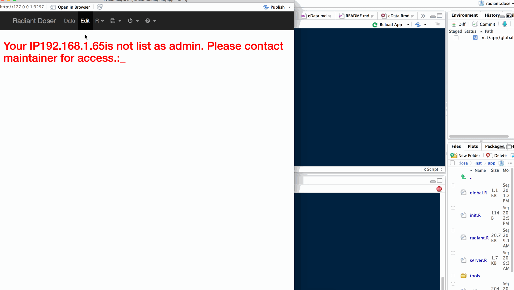
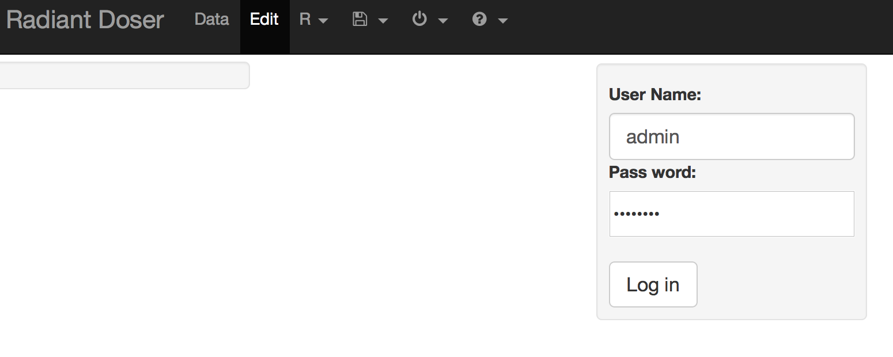
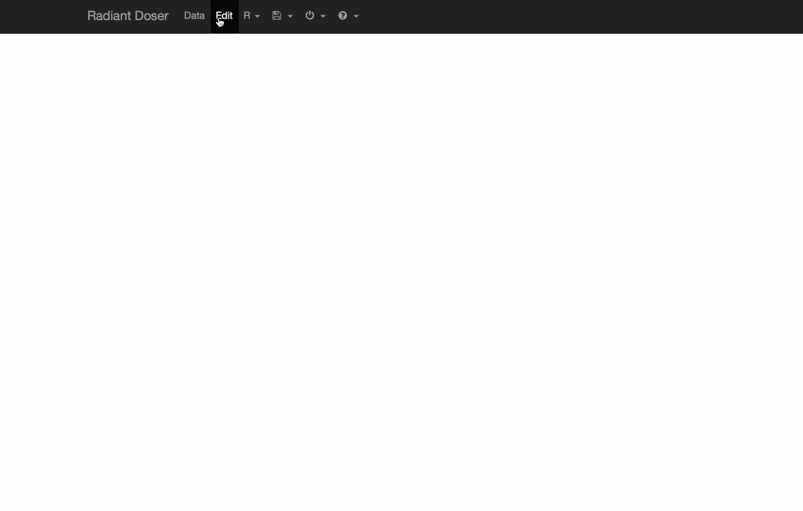
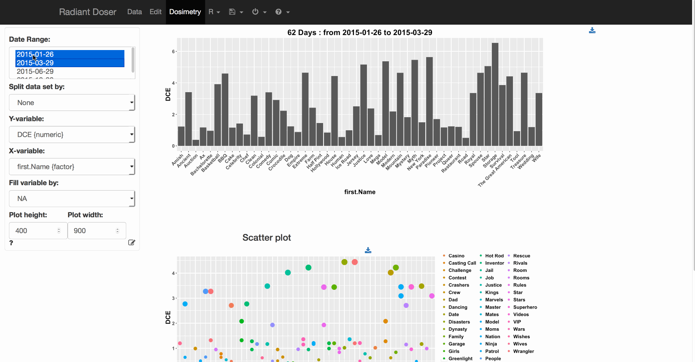

# radiant.dose: [radiant](https://github.com/radiant-rstats) extension for Medical and Dosimetry data manager

radiant.dose is a browser-based interface for Dosimetry data management, analysis and visualization. The app is developped by R, and based on the Shiny package. Example of radiant.dose server is hosted at [here](http://46.101.227.144:3838/radiant.dose/inst/app)

Interactivities

radiant.dose is listening user setting. Results update immediately when inputs are changed (i.e., no separate dialog boxes).

Context

radiant.dose focuses on Dosimetry and medical data administration.

## Security access for editing database

### IP authentification
Only selected IP are allowed to access to Edit panel

### Session Authentification
Login page is available only for authentified R session.

### encrypted keyword system  (MD5 algorithm)
Edit database needs keyword to access to Edit tabs

## Edit Data Set directly from render table

## Issue: update selected vars when setting the image size (state_multiple())

## Demo dosimetry plot

